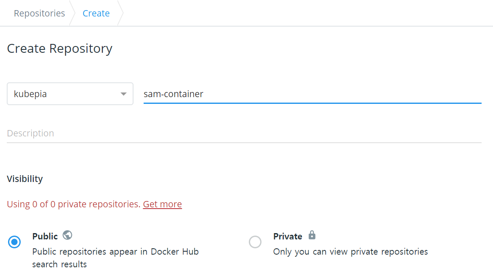

# sam-container

## Prerequisite

- ubuntu linux
- install jdk11
  ``` shell
  sudo apt-get update
  sudo apt-get install openjdk-11-jdk
  ```
- install maven
  ``` shell
  apt-get install maven
  ```
- install docker-ce
  ``` shell
  sudo apt-get update
  sudo apt-get remove docker docker-engine docker.io containerd runc
  sudo apt-get update
  sudo apt-get install     apt-transport-https     ca-certificates     curl     gnupg-agent     software-properties-common
  curl -fsSL https://download.docker.com/linux/ubuntu/gpg | sudo apt-key add -
  sudo apt-key fingerprint 0EBFCD88
  sudo apt-get update
  sudo apt-get install docker-ce docker-ce-cli containerd.io
  ```
- git clone
  ``` shell
  git clone https://github.com/kubepia/sam-container.git
  ```
- create docker hub account : https://hub.docker.com
  - create docker repository: ex) docker.io/kubepia/sam-container
    

