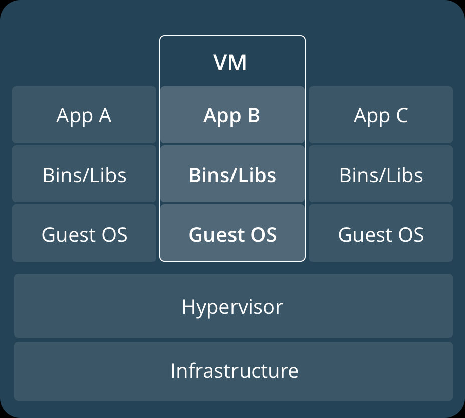

# Tutorial for container

- Concept & convension
- Run container
- Use volume
- Use network
- Build my own container

## Concept & convension
container | virtual machine
:----------:|:----------------:
 |

> Base Image별로 기본 기능과 크기가 상이함으로, Base Image에 대한 검증과 선별 작업 필요
  

### Container URI 구조
> Container Registry : container image와 해당 Container Image 버전관리 저장소  
> Project / Organization : Container의 소유 단위. 일반 Project는 여러 Repository가 저장됨.
  Library Project는 기본(Certified) Container로서 Repository 이름만으로도 Pull이 가능함.   
  예) docker pull nginx
> Repository : container를 위한 저장소로서, Tag를 통해 버전을 구분할 수 있음.  
> Tag : Readable version정보로서 container를 구분할 수 있음.  
> [중요] Unique ID : RepoDigests의 정보는 Container Registry내 유일한 값으로서 Tag이름이 다르더라도 동일한 Container의 경우 RepoDigests의 값은 동일함.
> 예) [container registry url] / [project, organization name] / [container name] / [tag]
> docker.io/kubepia/sam-container:v1.0, docker.io/kubepia/sam-container:latest

### images & container
> images : machine에서 사용될 container image
> pull images : registry로 부터 container image download into machine
> container : name이 주어진 instance
> clean unsued images & container : docker images prune, docker container prune

## Run container
1. run container : docker run [options...] [container_uri]
   1. --name : container name
   2. -d, --detach : detach instance from shell
   3. --restart [option] : no, on-failure, always, unless-stopped
   4. -e, --env : 환경변수 설정
   5. -m, --memory : 실행에 사용될 memory 용량
   6. -c, --cpus [digit] : 실행에 사용돌 CPU time
      1. --cpus 0.1 : 100ms cpu time
      2. --cpus 2 : 2 core cpu time
   7. -p, --publish : port expose of container, -p [host_port]:[container_port]
   8. -i, -intreactive : shell 입력 모드
   9. -t, --tty: shell출력 모드
   10. -v, --volume: 사용 할 Volume, --mount
   11. --rm : stop시 자동으로 container삭제
2. list container : docker ps -a
3. start/stop container : docker start/stop [contianer_name]
4. docker rm [container_name] : container 삭제
5. docker exec : run shell inside of container

### Step 1: run
1. sudo docker run -d --name nginx -p 80:80 nginx
2. curl localhost --> get html
3. sudo docker stop
4. sudo docker rm nginx

### Step 2: go into container
1. sudo docker run -d --name nginx -p 80:80 nginx
2. sudo docker exec -it nginx /bin/bash
3. [ctrl+d]

## Use Volume
