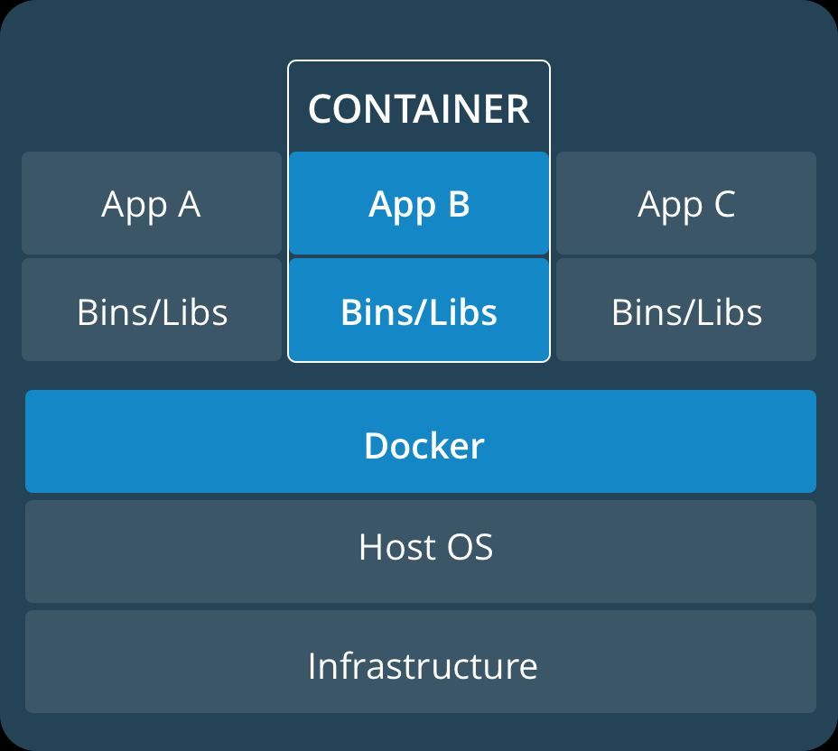

# Tutorial for container

- Concept & convension
- Run container
- Use volume
- Use network
- Build my own container
- [Tip !!](cheatsheet.md)


## Concept & convension
container | virtual machine
:----------:|:----------------:
 |

> Base Image별로 기본 기능과 크기가 상이함으로, Base Image에 대한 검증과 선별 작업 필요
  

### Container URI 구조
> Container Registry : container image와 해당 Container Image 버전관리 저장소  
> Project / Organization : Container의 소유 단위. 일반 Project는 여러 Repository가 저장됨.
  Library Project는 기본(Certified) Container로서 Repository 이름만으로도 Pull이 가능함.   
  예) docker pull nginx
> Repository : container를 위한 저장소로서, Tag를 통해 버전을 구분할 수 있음.  
> Tag : Readable version정보로서 container를 구분할 수 있음.  
> [중요] Unique ID : RepoDigests의 정보는 Container Registry내 유일한 값으로서 Tag이름이 다르더라도 동일한 Container의 경우 RepoDigests의 값은 동일함.
> 예) [container registry url] / [project, organization name] / [container name] / [tag]
> docker.io/kubepia/sam-container:v1.0, docker.io/kubepia/sam-container:latest

### images & container
> images : machine에서 사용될 container image
> pull images : registry로 부터 container image download into machine
> container : name이 주어진 instance
> clean unsued images & container : docker images prune, docker container prune

## Run container
1. run container : docker run [options...] [container_uri]
   1. --name : container name
   2. -d, --detach : detach instance from shell
   3. --restart [option] : no, on-failure, always, unless-stopped
   4. -e, --env : 환경변수 설정
   5. -m, --memory : 실행에 사용될 memory 용량
   6. -c, --cpus [digit] : 실행에 사용돌 CPU time
      1. --cpus 0.1 : 100ms cpu time
      2. --cpus 2 : 2 core cpu time
   7. -p, --publish : port expose of container, -p [host_port]:[container_port]
   8. -i, -intreactive : shell 입력 모드
   9. -t, --tty: shell출력 모드
   10. -v, --volume: 사용 할 Volume, --mount
   11. --rm : stop시 자동으로 container삭제
2. list container : docker ps -a
3. start/stop container : docker start/stop [contianer_name]
4. docker rm [container_name] : container 삭제
5. docker exec : run shell inside of container

### Step 1: run
1. sudo docker run -d --name nginx -p 80:80 nginx
2. curl localhost --> get html
3. sudo docker stop
4. sudo docker rm nginx

### Step 2: go into container
1. sudo docker run -d --name nginx -p 80:80 nginx
2. sudo docker exec -it nginx /bin/bash
3. [ctrl+d]


## Use Volume


> container에서 필요한 Storage를 정의, Host 또는 Filesystem을 마운트하여 사용할 수 있음.  
> 명시적으로 docker volume을 생성하여 사용할 수도 있으며,
> 실행시점에 연결설정을 할 수 있음  

- -v, --volume : -v [host|filesystem]:[container_path]
- -m, --mount : [docker documentation](https://docs.docker.com/storage/bind-mounts/)

### Step 1: run container with volume
1. create directory : ex) /home/azureuser/storage
2. sudo docker run -d --name nginx1 -v /home/azureuser/storage:/storage nginx
3. sudo docker run -d --name nginx2 -v /home/azureuser/storage:/storage nginx

### Step 2: create file
1. sudo docker exec -it nginx1 /bin/bash
   1. echo "Hello Docker" > /storage/message.txt
2. sudo docker exec -it nginx2 /bin/bash
   1. cat /storage/message.txt
3. cd /home/azureuser/storage
   1. cat /home/azureuser/storage/message.txt

### Step 3: Clean up
1. sudo docker stop nginx1 nginx2
2. sudo docker rm nginx1
3. sudo docker stop nginx2
4. sudo docker rm nginx2


## Use Network
> container는 가상네트웍 기술을 활용하여, host 또는 별도의 network i/f를 구성하여 사용할 수 있으며, plugin 구조로 다양한 가상네트웍을 사용할 수 있음.
> kubernetes의 경우 calico(기본값)를 활용하여 cluster(overlay) 네트웍을 구성함.

### kind
- bridge: 기본 네트웍드라이브로서,container 간, host와 isolation된 네트웍 구성
- host: host의 network i/f를 직접 활용. 권한이 필요함
- overlay : docker swarm, kubernetes등의 cluster 네트웍에 적용

### Step 1: run container nginx1 and nginx2 with network
1. sudo docker run -d --name nginx1  nginx
2. sudo docker run -d --name nginx2 --link nginx1 nginx

### Step 2: check network between containers
1. sudo docker exec -it nginx2 /bin/bash
   1. curl http://nginx1
   2. cat /etc/hosts

### Step 3: Clean up
1. sudo docker stop nginx1 nginx2
2. sudo docker rm nginx1 nginx2

## Use environment variable
> container 실행시에 container에서 사용하고자 하는 환경변수를 주입하여, container 실행 환경을 관리 할 수 있음.  
> 활용예로 실행모드(dev/staging/production), 서비스포트, i/f 대상 ip, application에서 사용하는 file 선택 등에 적용

1. -e, --env : 환경변수 key=value 로 지정

### Step 1: Run container with env
1. sudo docker run -d --name nginx -e DB_IP="10.10.10.20" nginx
2. sudo docker exec -it ngnix /bin/bash
   1. echo $DB_IP

### Step 2: clean up
1. sudo docker stop ngnix
2. sudodocker rm ngnix

## Build my own container
> Container Image를 만드는 순서는  
> build > tagging > push  
> *(주)* Tag 정보는 단순히 버전 이름이며, conventional하게 사용되는 xxx:latest는 단순 문자열로 tag의 기본버전명이다.  
> container pull, run등을 실행할 때 tag가 정보가 없는 경우 tag이름이 latest가 사용되지만.  의미적으로 최신버전을 지칭하는것이 아니므로  
> Relase 할 때 latest tag를 중복해서 push해야 함

> container image는 명령어 단위로 layer로 구성되어, 버전별로 layer를 분석하여 incremental build가 되며, 업데이트 시에도 변경되 layer만 업데이트됨.  
> 따라서, Dockerfile을 작성할 때 

### Dockerfile Structure
- From : build에 사용되는 base이미지
- Add, Copy : copy files from local machine or url(Add)
- Workdir : build 시 container 실행 경로
- Run : shell command in container
- Expose : 명시적으로 container에서 사용되는 port선언
- Entrypoint,CMD :Container가 실행될 명령어 정의
  - Entrypoint 는 재정의 될 수 없음
  - CMD는 docker run 시 override 가능함
    ``` Dockerfile
    FROM ubuntu
    RUN apt-get update
    ENTRYPOINT ["echo", "Hello"]
    CMD ["World"]
    ```
    ``` shell
    sudo docker run [image] 
    --> Hello World
    sudo docker run [image] "kubepia"
    --> Hello kubepia
    ```

### Build :Staged
> Application Build시 compile환경과 실행환경을 동일한 환경으로 맞추기 위해서 사용됨.  
> 또한, CI/CD Pipeline에 build에 필요한 환경을 Pipeline의 모듈로 하기 보다는  
> Container 자체적으로 그 환경을 설정하여, AnyWhere, Anytime Build가 가능하게 하기 위함.  
> GitAction, Gitlab CD와 같은 Public환경에서 Application Build와 함께 Container를 Build 할 경우, Build/Compile에 필요한 종속성을 해당 Service Provider에서 제공되는 것을 사용하는 것이 아닌, Source Level(Dockerfile)의 정의된 내용을 기준으로 처리 가능

``` Dockerfile
FROM maven:3.5.2-jdk-9 AS build
COPY src /usr/src/app/src
COPY pom.xml /usr/src/app
RUN mvn -f /usr/src/app/pom.xml clean package

FROM openjdk:9
COPY --from=build /usr/src/app/target/flighttracker-1.0.0-SNAPSHOT.jar /usr/app/flighttracker-1.0.0-SNAPSHOT.jar 
EXPOSE 8080
ENTRYPOINT ["java","-jar","/usr/app/flighttracker-1.0.0-SNAPSHOT.jar"]
```

